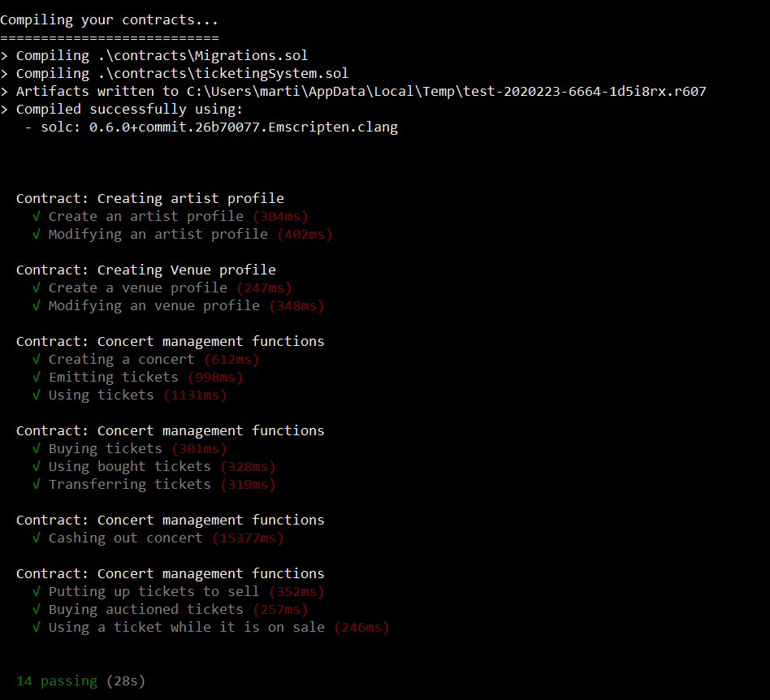

# Ticketing System on Ethereum

The goal of this project is to design a ticketing system allowing an artist to sell their tickets directly to their audience.
This solution is coded in Solidity in order to be deployed on EVM.<br>
There is only the back-end part here, including the Solidity smart contracts and the javascript test files.

## Smart Contract Testing

Test files verify the security of our ticketing system.<br>
You can run smart contracts test using truffle test.

```python
truffle test
```

Here is the result you should have:
<br>


## Contributing
Pull requests are welcome. For major changes, please open an issue first to discuss what you would like to change.

Please make sure to update tests as appropriate.

## License

This project was give buy our teacher [Henri Lieutaud](https://github.com/l-henri) and did by Ameryc Noël (https://github.com/aymericnoel) and [myself](https://github.com/jmc171144).
